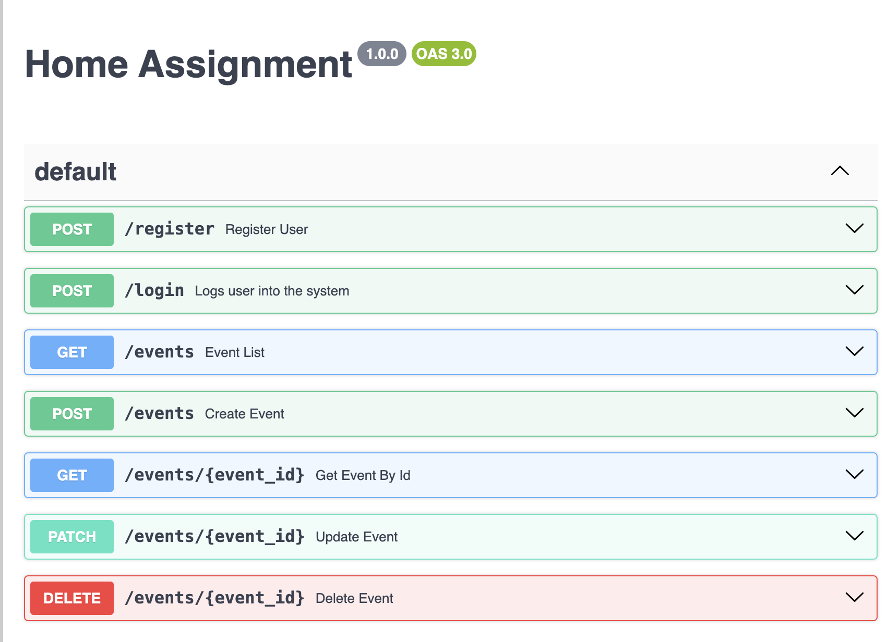

# AlfaBet Home Assignment

Develop a RESTful API that manages events, offering users the ability to schedule, retrieve,
update, delete, and be reminded of events with additional advanced features.

# Api Doc File

[a swagger](./openapi.yaml)


# Structure

```
├── app
│   ├── __init__.py
│   ├── models.py    	 	// Table Describe By Model Type using flask-sqlalchemy
│   ├── routes.py 		 	// APIs for Project
│   └── remainder.py     	// Task rmainer 30 minutes before using Celery and redis
├── tests
│   ├── routes_test.py.   	// pytest (mocking) + unittest
│   └── remainder_test.py	// pytest (mocking) + unittest
├── run.py				 	// run the project
├── openapi.yaml			// Api Documentation swagger
├── docker-compose.yml   	// postgresql and redis
└── readme.md            	// describe the assigment choice
```

## Remainder Understanding


## What I Change

I come from serverless. the Api Gateway allow us also the authotetication to move it to another service and to each one of them to do seperated and add I lamda autorizer to each service before go to service.
working with nano services to each service do something
services:
[ ] list events
[ ] create event
[ ] register event to queue
[ ] task manager remainer event
[ ] update event
[ ] delete event
[ ] get event
[ ] register
[ ] login
[ ] authorizer

create event when created push event to register event to queue by event bridge

## What I did not Do and Why

for my I think this readme and the project with short time looks what I can do.
I did not do the test but I maintion with what I use pytest for mocking the Models to look if the Api works. unittest is the besic for testing.
